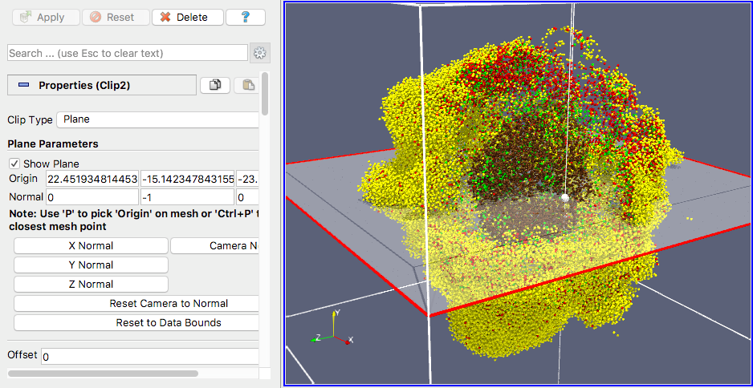

There are many options when it comes to analyzing your PhysiCell results. Mainly, there are two categories: tools for data **processing** and for data **visualization**. However, some of the presented frameworks can be used to achieve both types of analysis.

There is no definite answer to the questions "Which tool is the best?" or "What framework should I use?", as this depends on what you are trying to achieve, as well as your previous knowledge and experience with the available tools. Thus, here we'll go through some of the options to illustrate their potential, and make this choice a bit easier.

## Data analysis (and some visualization)

When it comes to processing data, both **Python** and **MATLAB** can be used. Currently, my focus is placed on Python, as this is an open-source language and is more accessible to general users. However, if you feel more comfortable with MATLAB, you can choose to do so and adapt some of our Python functions, or implement new features.

### Python

PhysiCell developers have introduced tool, called [python-loader](http://physicell.org/physicell-tools-python-loader/), that allows you to load the data from an output file into a Python object, called **pyMCDS**. Despite being quite **good for exploratory data analysis**, as all outputs are stored in the pyMCDS data structure, this also makes pyMCDS a bit **too slow for processing large amounts of data**. Hence, we have built some custom functions for specific routines, that scale much better. For more information, check the section on [PhysiPy](data-analysis/physipy).

### MATLAB

Just like the **python-loader** module, there are also scripts built by the PhysiCell developers that allow you to **load data into MATLAB**. These can be found [here](http://www.mathcancer.org/blog/working-with-physicell-snapshots-in-matlab/), alongside a tutorial that demonstrates how the data can be processed and visualized once it has been loaded.

## Data Visualization

### ParaView



ParaView is a great tool to use when you want to look into your cell data to understand what it looks like. Using PhysiCell's [ParaView routines](http://www.mathcancer.org/blog/paraview-for-physicell-part-1/), you will be able to load the data from an output file and automatically render it to a 3D object that can be interacted with. 

!!! warning
    I had some troubles following this tutorial. In case you run into similar issues, here are some suggestions on how to deal with them:
     
    ### "No module named scipy"
    The following line of code should be added to the Python script (after importing os but before importing scipy). Modify the path according to the location of your Python distribution in your computer.
  
    ```python
    sys.path.insert(0,'c:\python27\Lib\site-packages')
    ```

    You can also **run this line in ParaView's Python Shell** (available under the `Tools` tab), which will set the location of your Python distribution until you close ParaView again. This is helpful if you are going to load multiple states and do not want to copy this line of code into every Python file.

    ### Render specific frames
    The Python file provided by PhysiCell to load a specific timepoint specifies timepoint 3696. You have to change this to a timepoint that you actually have in your output folder. The rendered frame is given by the last line of the script

    ```python
    for iframe in [3696]:    # or, "in range(start, end+1, step):"  render_cells(iframe)
    ```

    ### Animations
    The Python file provided by PhysiCell to create animations is not optimzied for Windows. Make sure to change this line:

    ```python
    dir = os.environ['HOME'] + '/Downloads/'
    ```

    to check the OS instead

    ```python
    if 'win32' in sys.platform:   # running on Windows    
	    dir = os.environ['USERPROFILE'] + '/Downloads/'
    else:   # Linux or darwin/OSX    
	    dir = os.environ['HOME'] + '/Downloads/'
    ```

    ### Spheres not rendering (center points only)

    - **Glyphs** - Guarantee that cell_diameter is selected as an active attribute and that the Glyph Type (in Glyph Source) is selected as Sphere;

    - **OSPRay** - For each clip, guarantee that the representation (Display) is selected as 3D Glyphs. Then, in Glyph Parameters, define the Glyph Type as sphere, the scalre array as cell_diameter and the radius as 1 (may be incorrect, but as of now it is the only way for it to work)


### POVWriter
[](https://www.youtube.com/watch?v=nJ2urSm4ilU)

POVWriter is not as flexible as ParaView, as it renders data into a static image and not an interactable object. However, it offers high-quality renderings of your results. Plus, it can be programmed to adapt to your own style and you can use some simple additional tools to create animations. Check [PhysiCell's tutorial](http://www.mathcancer.org/blog/povwriter/) for more information on how to use this tool.
